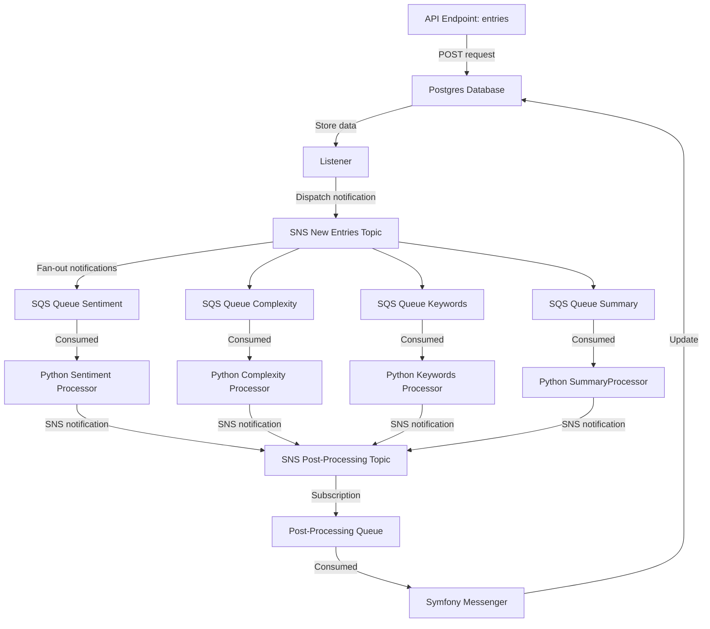

# Moooood

## Install

```bash
make install
```


```mermaid
graph TD
    A[API Endpoint: entries] -->|POST request| B[Postgres Database]
    B -->|Store data| C[Listener]
    C -->|Dispatch notification| D[SNS New Entries Topic]
    D -->|Fan-out notifications| E1[SQS Queue Sentiment]
    D --> E2[SQS Queue Complexity]
    D --> E3[SQS Queue Keywords]
    D --> E4[SQS Queue Summary]
    E1 -->|Consumed| F1[Python Sentiment Processor]
    E2 -->|Consumed| F2[Python Complexity Processor]
    E3 -->|Consumed| F3[Python Keywords Processor]
    E4 -->|Consumed| F4[Python SummaryProcessor]
    F1 -->|SNS notification| G[SNS Post-Processing Topic]
    F2 -->|SNS notification| G
    F3 -->|SNS notification| G
    F4 -->|SNS notification| G
    G -->|Subscription| H[Post-Processing Queue]
    H -->|Consumed| I[Symfony Messenger]
    I -->|Update| B
```
