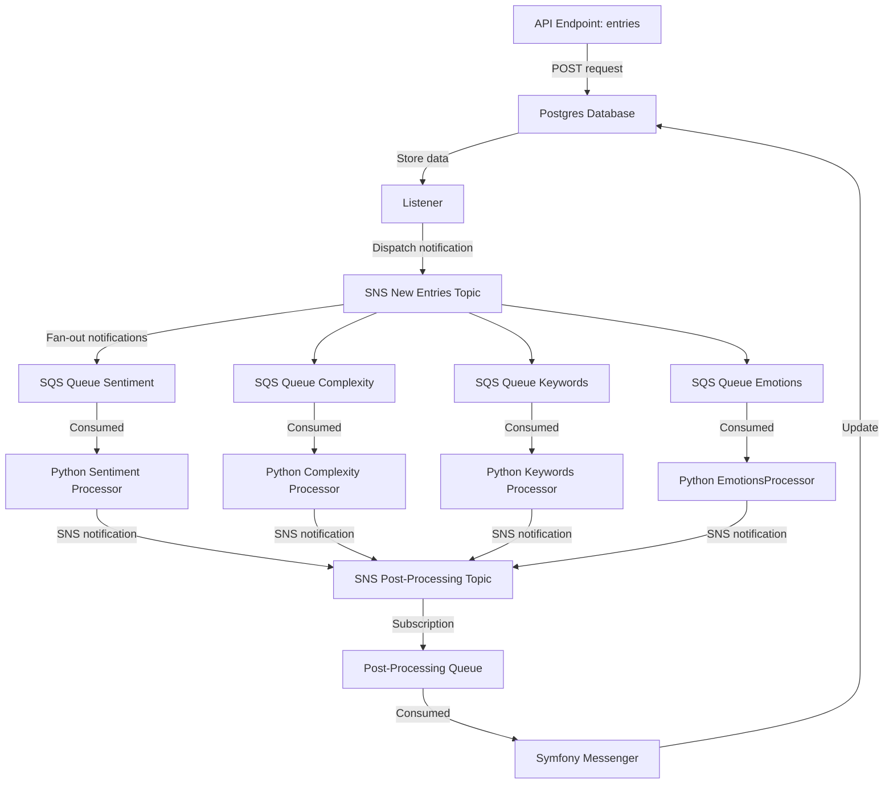
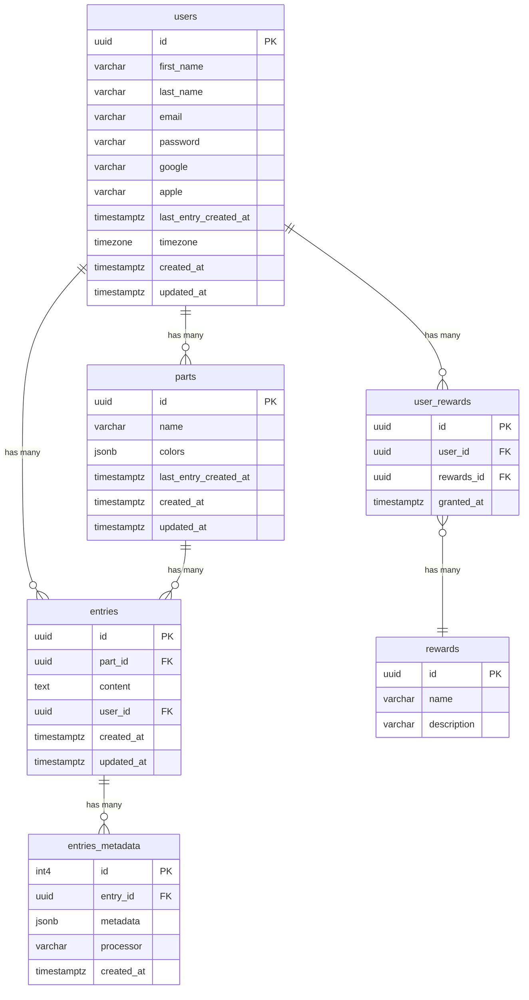

# Moooood

## Install

```bash
make install
```

## Architecture


```mermaid
graph TD
    A[API Endpoint: entries] -->|POST request| B[Postgres Database]
    B -->|Store data| C[Listener]
    C -->|Dispatch notification| D[SNS New Entries Topic]
    D -->|Fan-out notifications| E1[SQS Queue Sentiment]
    D --> E2[SQS Queue Complexity]
    D --> E3[SQS Queue Keywords]
    D --> E4[SQS Queue Emotions]
    E1 -->|Consumed| F1[Python Sentiment Processor]
    E2 -->|Consumed| F2[Python Complexity Processor]
    E3 -->|Consumed| F3[Python Keywords Processor]
    E4 -->|Consumed| F4[Python EmotionsProcessor]
    F1 -->|SNS notification| G[SNS Post-Processing Topic]
    F2 -->|SNS notification| G
    F3 -->|SNS notification| G
    F4 -->|SNS notification| G
    G -->|Subscription| H[Post-Processing Queue]
    H -->|Consumed| I[Symfony Messenger]
    I -->|Update| B
```

## Database


```mermaid
erDiagram
    users ||--o{ entries : "has many"
    users ||--o{ parts : "has many"
    users ||--o{ user_rewards : "has many"
    users {
        uuid id PK
        varchar first_name
        varchar last_name
        varchar email
        varchar password
        varchar google
        varchar apple
        %% not implemented yet
        timestamptz last_entry_created_at
        timezone timezone
        timestamptz created_at
        timestamptz updated_at
    }

    parts ||--o{ entries : "has many"
    %% not implemented yet
    parts {
        uuid id PK
        varchar name
        jsonb colors
        timestamptz last_entry_created_at
        timestamptz created_at
        timestamptz updated_at
    }

    user_rewards }o--|| rewards : "has many"
    %% not implemented yet
    rewards {
        uuid id PK
        varchar name
        varchar description
    }

    %% not implemented yet
    user_rewards {
        uuid id PK
        uuid user_id FK
        uuid rewards_id FK
        timestamptz granted_at
    }


    entries {
        uuid id PK
        uuid part_id FK
        text content
        uuid user_id FK
        timestamptz created_at
        timestamptz updated_at
    }

    entries ||--o{ entries_metadata : "has many"
    entries_metadata {
        int4 id PK
        uuid entry_id FK
        jsonb metadata
        varchar processor
        timestamptz created_at
    }
```
